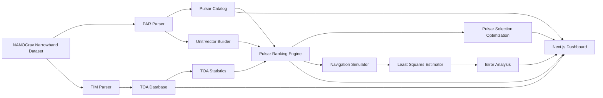

# PulsarNav AI

**Autonomous Pulsar-Based Deep Space Navigation Framework**

PulsarNav AI is a research-grade software framework for exploring autonomous spacecraft navigation using millisecond pulsars and real pulsar timing data. The project combines a Python scientific pipeline with a modern Next.js mission-control dashboard for catalog creation, TOA parsing, pulsar ranking, spacecraft simulation, least-squares navigation, error analysis, pulsar selection optimization, and 3D visualization.

The current implementation is designed for academic demonstrations, SAC/ISRO-style project presentations, and reproducible research prototypes using the NANOGrav 12.5-Year Narrowband Dataset.

## Features

- Pulsar catalog builder from TEMPO/TEMPO2 `.par` files
- TOA database parser from NANOGrav narrowband `.tim` files
- RA/DEC and ecliptic-coordinate conversion to Cartesian unit vectors
- Pulsar ranking engine using timing precision, observation duration, TOA count, spin stability, and sky distribution
- Spacecraft position simulator for Earth orbit, Earth-Moon space, and deep-space regions
- Pulse propagation delay model using `delay = r dot n / c`
- Least-squares and weighted least-squares position estimation
- Monte Carlo error analysis across timing noise levels and pulsar counts
- Pulsar selection optimization using geometry dilution of precision
- Research dashboard with dark aerospace mission-control UI
- 3D space visualization using Three.js and React Three Fiber
- Charts using Recharts and Plotly
- Lightweight sample CSV files for GitHub without committing the full dataset

## Architecture



## Folder Structure

```text
.
├── app/                         # Next.js App Router pages
│   ├── dashboard/               # Mission-control dashboard
│   ├── globals.css              # Tailwind/global styles
│   ├── layout.tsx
│   └── page.tsx                 # Landing page
├── components/                  # Reusable React UI, charts, 3D scene
├── docs/                        # Project documentation and checklists
├── lib/                         # Frontend utilities and demo mission data
├── pulsar_nav/                  # Python navigation framework
│   ├── cli.py                   # Pipeline CLI
│   ├── config.py
│   ├── coordinates.py
│   ├── parsing.py
│   ├── ranking.py
│   ├── simulation.py
│   └── visualization.py
├── sample_data/                 # Small sample CSVs safe for GitHub
├── scripts/
│   └── run_pipeline.py          # Python pipeline launcher
├── .env.example
├── .gitignore
├── LICENSE
├── package.json                 # Frontend dependencies and scripts
├── requirements.txt             # Python dependencies
├── tailwind.config.ts
└── tsconfig.json
```

Large local directories such as `NANOGrav_12yv4/`, `dataset/`, `output/`, `.next/`, and `node_modules/` are intentionally excluded from Git.

## Installation

### Prerequisites

- Python 3.10+
- Node.js 18+
- npm
- Git

### Python Environment

```bash
python3 -m venv .venv
source .venv/bin/activate
pip install --upgrade pip
pip install -r requirements.txt
```

### Frontend Environment

```bash
npm install
```

## Dataset Setup

Download the **NANOGrav 12.5-Year Narrowband Dataset** from the official NANOGrav data release page.

Place the dataset in one of these supported layouts:

```text
NANOGrav_12yv4/
└── narrowband/
    ├── par/
    └── tim/
```

or:

```text
dataset/
└── narrowband/
    ├── par/
    └── tim/
```

For Phase 1/MVP processing, this project reads only:

```text
narrowband/par/*.par
narrowband/tim/*.tim
```

The following dataset folders are ignored:

```text
clock/
noise/
residuals/
templates/
wideband/
alternate/
```

Do not commit the full dataset to GitHub. The repository includes only lightweight files under `sample_data/`.

## Usage

### Run the Scientific Pipeline

```bash
python3 scripts/run_pipeline.py --dataset-root . --output-dir output
```

Optional faster demo run:

```bash
python3 scripts/run_pipeline.py --dataset-root . --output-dir output --positions 100 --trials 20
```

Generated local outputs include:

```text
output/pulsar_catalog.csv
output/pulsar_unit_vectors.csv
output/toa_database.csv
output/toa_statistics.csv
output/ranked_pulsars.csv
output/spacecraft_positions.csv
output/navigation_demo.csv
output/error_analysis.csv
output/optimal_pulsar_sets.csv
output/position_optimal_pulsar_sets.csv
output/dashboard.html
output/final_report.md
```

`output/` is excluded from Git because generated science products can be large.

### Run the Web UI

```bash
npm run dev
```

Open:

```text
http://localhost:3000
```

Dashboard:

```text
http://localhost:3000/dashboard
```

### Build the Web UI

```bash
npm run build
```

## Screenshots

Add screenshots after running the UI locally:

```text
docs/screenshots/landing-page.png
docs/screenshots/dashboard-home.png
docs/screenshots/navigation-simulator.png
docs/screenshots/error-analysis.png
docs/screenshots/space-view.png
```

Suggested README embeds:

```markdown


```

## Sample Data

The repository includes small CSV samples:

```text
sample_data/pulsar_catalog_sample.csv
sample_data/ranked_pulsars_sample.csv
sample_data/toa_database_sample.csv
```

These files are safe to commit and are intended for documentation, UI mockups, and quick inspection. They are not a replacement for the full NANOGrav dataset.

## Future Work

- Integrate full TEMPO2/PINT timing-model support
- Add real residual modeling and clock corrections
- Add Bayesian navigation estimation
- Add genetic algorithm pulsar-set optimization
- Add AI pulse-quality predictor using Random Forest/XGBoost
- Add authenticated report export workflows
- Add automated tests for parsers, ranking, and navigation estimation
- Add CI for Python and Next.js builds
- Add real-time dashboard ingestion from generated CSV outputs

## License

This project is licensed under the MIT License. See [LICENSE](LICENSE).

## Author

**Supryo**

Project: PulsarNav AI – Autonomous Pulsar-Based Deep Space Navigation Framework

## Citation and Dataset Credit

This project is an independent research software prototype using the NANOGrav 12.5-Year Data Release. Please cite NANOGrav appropriately when using the dataset in academic work.
